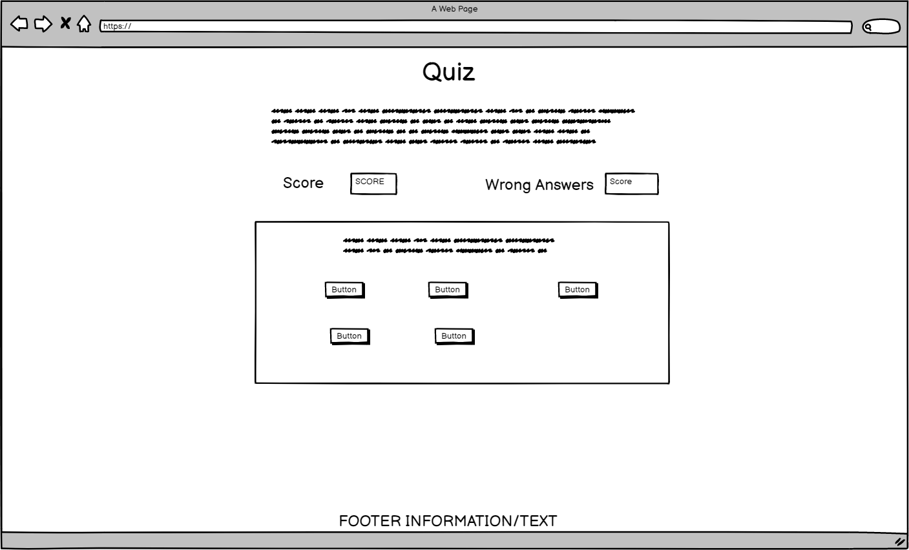
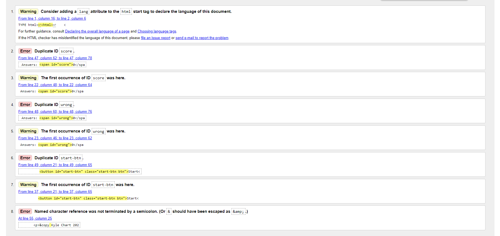
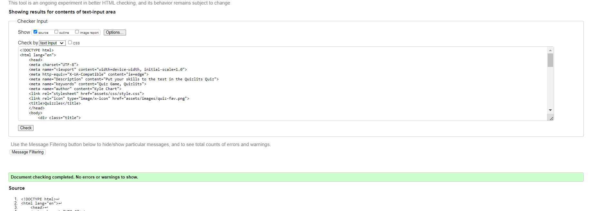
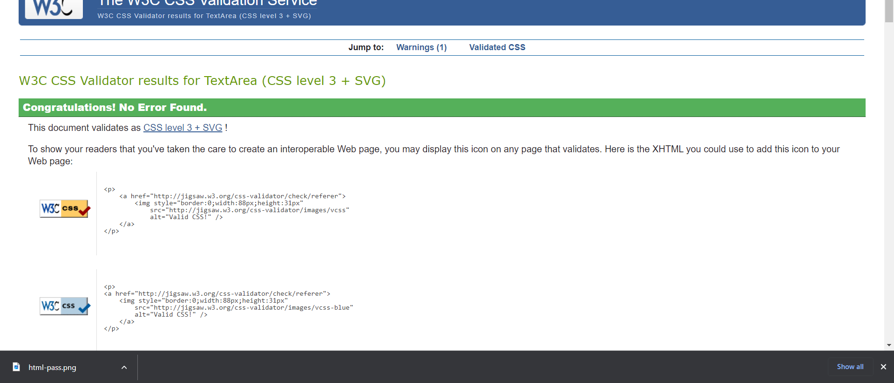

# Quizzels

Link to live Quizzels project: [Quizzels - CI Project Two](https://mrekyle.github.io/ci-project-2/)

## Table of Contents 
1. The Project
    - Project Goals
    - Initial Design (Wireframes)
2. Features
    - Implemented
    - Future Development
3. Pages/States
    - Home 
    - Quiz 
    - End Game
4. Technology used
5. Testing
    - CSS
    - HTML
    - JS
    - Lighthouse
6. Bugs
7. Project Deployment
8. Sources
    - Code
    - Fonts
    - Colors
    - Inspiration 

## The Project

### Project Goals

The initial goal of the project was to design a simple yet fun and interactive quiz application that can be used by anyone to test there general knowledge. Allowing all ages to partake in the quiz, no matter what the occasion or reason. Such as at a pub quiz night or a late night cant sleep test.

### Initial Design (Wireframes)

During the initial design phase of the project, wire frames were created to give a visual design idea and an end goal to work towards. With thought and care taken to make the design of the application as responsive and user friendly as possible for all device types. 
Whilst the wire frames may not be accurate to the device screen size. The designs has been adjusted to work and function correctly on all device types.

### Initial Game Home Page

### Initial Quiz Page 

### Initial End Game Page

### Initial Iphone/Ipad Game Home Page 

### Initial Iphone/Ipad Quiz Page

### Initial Iphone/Ipad End Game Page 

## Features 

- Removed | Wrong score count due to feature not working in final build before project deadline. | With all code relating being removed

### Implemented

The basic features that are currently implemented into the Quiz are

- Multiple Quiz Questions
- Score counter for correct answers
- Resetting the quiz to try again once the quiz is finished 

### Future Development

Future features that I plan to add are

- Wrong score count
- User profiles
- Image quiz
- Different Genre's
- Leader boards
- Time Challenge's
- Sounds for correct/wrong answers
- Add API for different quiz's depending on Genre 

## Pages/States

### Home

Final home page design 

### Quiz

Final quiz game design 

### End Game

Final Endgame design

## Technology Used

During the development of the app multiple different types of technology was used and utilized to build the final application. 

- HTML - Was used to create the basic web page for the project
- CSS - Was used to style the web page and the different elements that make up the quiz
- JS - Was used to build all the functionally of the quiz. Allowing for multiple questions, score counters and changing the appearance of elements
- Github - Was used for source control of the project allowing progress of the application to be tracked and stored in one place
- Gitpod - Was used as an IDE. Allowing for the development of the application anywhere anytime
- Github Pages - Was used to host the application on the internet for all to use and see

## App Testing

During the development of the Project it has been subjected to different testing methods to ensure that all points are hit. No errors are found in the code as well as manual testing of the app to ensure everything works as intended. There was also testing involved to ensure that the application would be responsive and work on all screen sizes and device types. To allow for the best accessability possible. The image for this can be found at the top of the document.

| Test | Intended Result | Result |
|------|-----------------|--------|
|Start button press | To start the quiz and display the first question | Passed |
|Next button press | To click through to the next question and check if correct | Passed |
|Reset button press | To reset the quiz once completed | Passed |
|Color change | Color change on buttons based on correct an wrong answers | Passed | 

### HTML

Html Testing on W3C Validator - 

Html Fail

Html Pass

### CSS

CSS Testing on W3c Validator - 

CSS Fail 

CSS Pass

### Lighthouse

Lighthouse was used to test the initial performance, accessibility, best coding practices and SEO of the entire web application. In the below image is the outputted score. The performance is slightly low due to chrome extensions interfering with the testing. 

It was recommended to redo the test in Incognito mode. Which is done below. Giving a small increase in performance. 

## Bugs

During the development of the application there were many different bugs along the way. From a simple syntax error to a quiz breaking bug. Some of them are in the table below.

| Bug | Fix |
|-----|-----|
| Only one answer being shown at a time | Filtering through the array to display multiple answers and create multiple buttons |
| Css shifting the elements around the page. Error on an id adding a margin on the wrong element | Removed unused syntax | 

## Project Deployment

Github pages was used to deploy the application live to the internet. The live Quiz can be found [Here](https://mrekyle.github.io/ci-project-2/)

The deployment steps are as follows - 

## Sources

### Code

All code for the project was written by myself. Whilst using Stack Overflow, Google, various Youtube videos for reference and problem solving. 

### Fonts

Font that were used for the project are from Google Fonts.

Fonts used:

- [Mina ](https://fonts.google.com/specimen/Mina?preview.text=You%20are%20now%20in%201st%20place%20on%20the%20leaderboard&preview.text_type=custom&query=mina)
- [Rubik ](https://fonts.google.com/specimen/Rubik?preview.text=You%20are%20now%20in%201st%20place%20on%20the%20leaderboard&preview.text_type=custom)

### Colors 

The colors that were chosen for the project were picked because they were all simple yet bold colours. All contrasting each other allowing for an easy to read/view application. 

### Quiz Questions

The questions for the quiz have come from the page linked below.
- [Quiz Questions](https://www.cosmopolitan.com/uk/worklife/a32388181/best-general-knowledge-quiz-questions/)